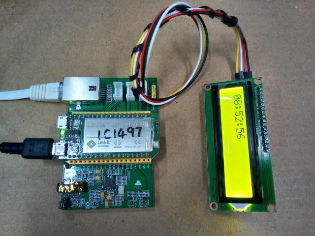

# Object : The example of LCD1602 i2c proc driver and clock application

   

## Test HW: Linkit 7688
## Test SW: openwrit 3.18.109

## Usage:
	copy lcd1602i2c2 to openwrt/package/kernel
	make menuconfig
		select
		Kernel modules
		Other modules
		[*]kmod-lcd1602i2c2
	make package/lcd1602i2c2/compile V=s
	opkg install ipk to Linkit 7688

	echo -e -n "\n0123456" > /proc/LCDI2C
	The LCD1602 shwo 0123456

	echo -e -n "\b" > /proc/LCDI2C
	The LCD1602 turn off backlight

	echo -e -n "\a" > /proc/LCDI2C
	The LCD1602 turn on backlight

---

	copy clock_gcat to openwrt/package/
	copy clock_gcat_set_autorun to openwrt/package/
	make menuconfig
		select
		Utilities
		[*]clock_gcat
		[*]clock_gcat_set_autorun
	make package/clock_gcat/compile V=s
	make package/clock_gcat_set_autorun/compile V=s
	opkg install ipk to Linkit 7688

	reboot Linkit 7688 and LCD show time.

---

## RTC class:
	Linkit7688, openwrt 15.05.1, linux 3.18.109 
	預設RTC class沒開,需要啟用 
 	make kernel_menuconfig 
  	Device Driver 
		[]Real Time Clock 

預設i2c_ralink而不是I2C, 需要啟用 
make kernel_menuconfig 
  Device Driver 
    I2C support 
      []I2C support 
Real Time Clock內,才會出現 ds1307 / pcf8563可選. 
編出rtc-ds1307.ko / rtc-pcf8563.ko後,要把I2C關掉, 不然系統開機時會與i2c_ralink沖突而報錯. 

開機就掛載rtc-ds1307.ko 
把rtc-ds1307.k 
拷到 /lib/modules/3.18.109 
在/etc/modules.d內,加檔案60-rtc 
內容為一行字串 
rtc-ds1307 

若不想動到device tree, 可用下列方法掛載 
echo ds1307 0x68 > /sys/bus/i2c/devices/i2c-0/new_device 
echo pcf8563 0x51 > /sys/bus/i2c/devices/i2c-0/new_device 
就會出現/dev/rtc0 
程式hwclock就可以讀寫RTC 

開機就由RTC設定系統時間 :
沒有RTC時, openwrt預設是用/etc/init.d/sysfixtime讀取/etc內檔案的時間,以最新的檔案時間設定為系統時間, 
可以把二行字串放到這檔案內 
echo ds1307 0x68 > /sys/bus/i2c/devices/i2c-0/new_device 
hwclock -s 

或是/etc/rc.local 

If the code help you, how about buy street cat a fish can ? 
